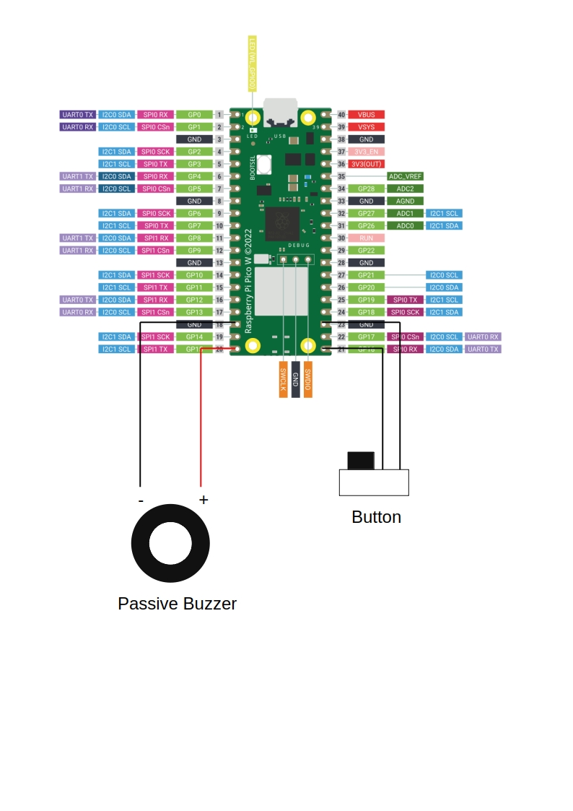

# Buzzer Songs

---

Using a **passive** buzzer and a button, this script allows to play a short melody.
Please reference the basic diagram.

(Image Credit: [raspberrypi.com](https://www.raspberrypi.com/documentation/microcontrollers/pico-series.html#pico-1-family))



A few melodies are included.  As currently set, each button press will play the next melody in the list in a looping fashion.

Melodies are defined sequentially using notes, durations, and rest values.

Examples:

```bash
four_notes = [
# (Name, duration, rest)
("G6", 0.25, 0.5), # -> G6 quarter note followed by half rest
("E6", 0.75, 0), # -> E6 dotted half note without a rest
("C6", 1.0, 0), # -> C6 whole note without a rest
("A5", 0.5, 0.25), # -> A5 half note followed by quarter rest

]  
```

Once the song is built, you can shift the pitch and/or tempo if needed.
Tempo is defined via beats per minute, and the pitch is modified by shifting the octave up or down.

```bash
          # (melody, tempo, octave_shit)
my_melody = (four_notes, 210, -0.5),

```

Add the song to the list
```bash
songs = [

my_melody,
dasiy_bell,
...

]
```

Copy the script your device and it will run automatically.