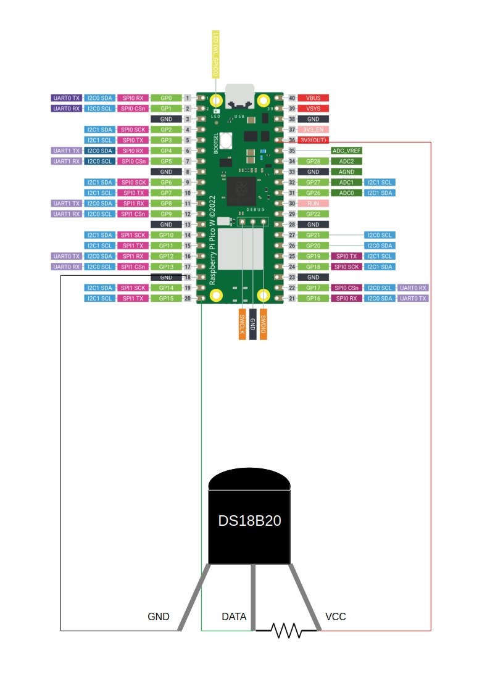

# Temperature Sensors
 ---

Measure temperature (C or F) from one or more sensors (DS18B20) and print the output.
This can be used in conjunction with other peripherals or methods such as an attached screen or relay device to trigger a local device.

Please reference the diagram.

(Image Credit: [raspberrypi.com](https://www.raspberrypi.com/documentation/microcontrollers/pico-series.html#pico-1-family))



This project assumes each device has a dedicated pin.  
Recommended resistor values of 2.2K to 4.7K depending on wire length.  
Twisted pair CAT5e or similar recommended.

Modify values as needed:
- pin_numbers are mapped to their corresponding sensor names.
- measurement period length, sample frequency seconds (additive, default values produce readings every ~3 seconds)
- Celsius by default, convert to Fahrenheit if desired

```bash'
pins = {
    15: "First Sensor Name",
    16: "Second Sensor Name",
    17: "Third Sensor Name",
}

measurement_period_ms = 750
sample_frequency_seconds = 2

fahrenheit: bool = False
```

Copy the script to your device. It should begin to print a dictionary of sensors and their temperatures.